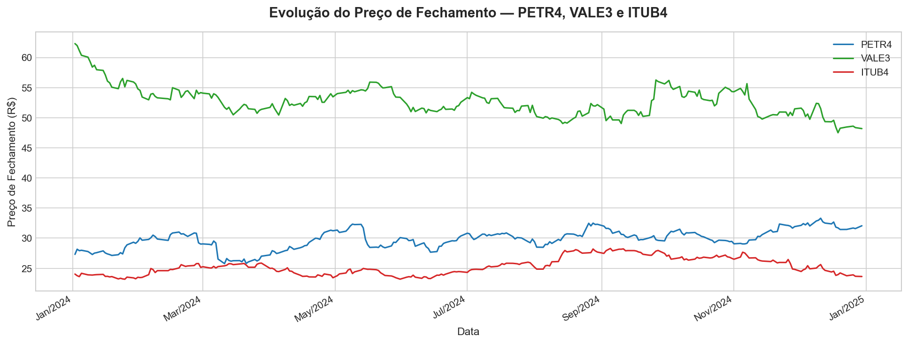
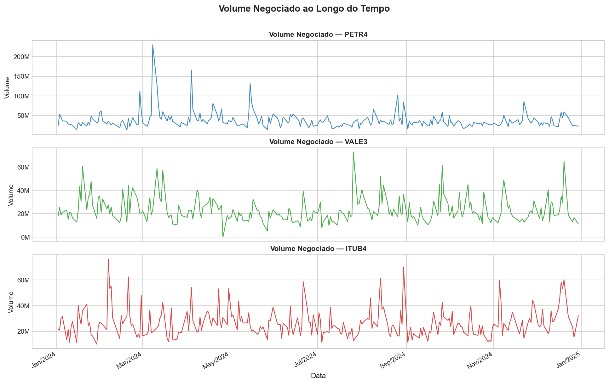
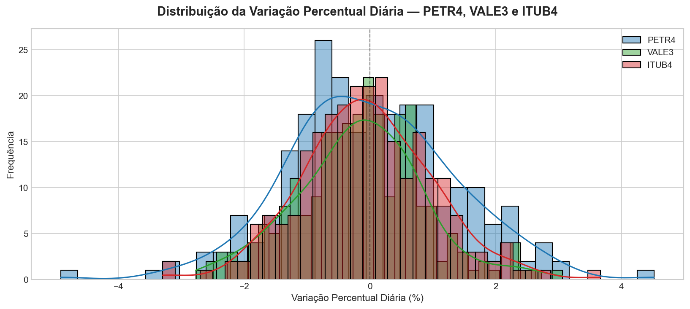

<div align="center">


<br/><br/>

#  Pipeline de Dados Financeiros — B3

### Coleta · Tratamento · Análise Visual de Ações Brasileiras

<br/>

> Projeto desenvolvido para praticar as etapas fundamentais de um pipeline de dados:  
> ingestão, limpeza, transformação e visualização — usando dados reais da bolsa brasileira.

</div>

---

##  Contexto

Esse projeto nasceu de uma pergunta simples: **como seria estruturar um pipeline de dados do zero, do jeito que empresas reais fazem?**

Para responder isso na prática, escolhi trabalhar com dados financeiros da B3 — um domínio com dados públicos, bem estruturados e com comportamento interessante para análise. O objetivo não foi fazer algo complexo, mas sim fazer algo **bem feito**: organizado, documentado e reproduzível.

**Ativos analisados:**

| Ticker | Empresa | Setor |
|--------|---------|-------|
| `PETR4` | Petrobras | Energia / Petróleo |
| `VALE3` | Vale | Mineração |
| `ITUB4` | Itaú Unibanco | Financeiro |

**Período:** últimos 12 meses · **Fonte:** Yahoo Finance via `yfinance`

---

##  Arquitetura do Pipeline

```
Yahoo Finance (yfinance)
        │
        ▼
┌───────────────────┐
│  01_coleta_dados  │  → Ingestão dos dados brutos
│     .ipynb        │  → Salva em data/raw/
└────────┬──────────┘
         │
         ▼
┌───────────────────┐
│ 02_tratamento_    │  → Limpeza de nulos
│   dados.ipynb     │  → Conversão de tipos
│                   │  → Engenharia de features
└────────┬──────────┘  → Salva em data/processed/
         │
         ▼
┌───────────────────┐
│ 03_analise_       │  → 3 visualizações analíticas
│  visual.ipynb     │  → Interpretação dos resultados
└───────────────────┘
```

---

##  Estrutura de Pastas

```
projeto_pipeline_b3_estagio/
│
├──  data/
│   ├── raw/                        # Dados brutos — nunca modificados
│   │   ├── petr4_dados_brutos.csv
│   │   ├── vale3_dados_brutos.csv
│   │   └── itub4_dados_brutos.csv
│   │
│   └── processed/                  # Dados após limpeza e transformação
│       ├── petr4_dados_tratados.csv
│       ├── vale3_dados_tratados.csv
│       └── itub4_dados_tratados.csv
│
├──  notebooks/
│   ├── 01_coleta_dados.ipynb       # Etapa 1: ingestão
│   ├── 02_tratamento_dados.ipynb   # Etapa 2: limpeza e transformação
│   └── 03_analise_visual.ipynb     # Etapa 3: visualizações e conclusões
│
├──  images/                      # Gráficos exportados
│
├── requirements.txt
└── README.md
```

---

##  Análises Realizadas

### Gráfico 1 — Evolução do Preço de Fechamento
Série temporal comparando os três ativos ao longo do período. Permite identificar tendências, períodos de alta e correlação entre papéis.



---

### Gráfico 2 — Volume Negociado
Volume diário de cada ativo em painéis separados. Picos de volume costumam coincidir com eventos relevantes — resultados, fatos relevantes, movimentos macro.



---

### Gráfico 3 — Distribuição da Variação Diária
Histograma com KDE mostrando como se distribuem as oscilações diárias. Quanto mais larga a distribuição, maior a volatilidade do ativo.



---

##  Como Reproduzir

```bash
# 1. Clone o repositório
git clone https://github.com/seu-usuario/projeto_pipeline_b3_estagio.git
cd projeto_pipeline_b3_estagio

# 2. Crie e ative um ambiente virtual
python -m venv venv
source venv/bin/activate        # Linux / Mac
venv\Scripts\activate           # Windows

# 3. Instale as dependências
pip install -r requirements.txt

# 4. Execute os notebooks em ordem
jupyter notebook
```

>  Execute os notebooks **na ordem numérica**. O notebook 02 depende dos arquivos gerados pelo 01, e o 03 depende dos gerados pelo 02.

---

##  Stack Utilizada

| Biblioteca | Versão | Uso no projeto |
|---|---|---|
| `yfinance` | latest | Coleta dos dados históricos da B3 |
| `pandas` | 2.x | Manipulação e tratamento dos DataFrames |
| `numpy` | 1.x | Cálculos numéricos auxiliares |
| `matplotlib` | 3.x | Gráfico de evolução de preços |
| `seaborn` | 0.x | Gráficos de volume e distribuição |

---

##  Decisões Técnicas

Algumas escolhas feitas durante o projeto que valem registrar:

**Por que salvar os dados em CSV entre etapas?**  
Para desacoplar as etapas do pipeline. Cada notebook pode ser executado de forma independente, o que facilita debug, reaproveitamento e compartilhamento parcial do projeto.

**Por que `dropna()` em vez de preencher os nulos?**  
Em séries temporais financeiras, preencher valores ausentes com médias ou interpolações pode distorcer análises de volatilidade e volume. A remoção é a abordagem mais conservadora e honesta para esse contexto.

**Por que subgráficos separados para o volume?**  
Os três ativos têm volumes em magnitudes muito diferentes. Plotar juntos tornaria dois deles ilegíveis. Painéis com eixos Y independentes preservam a informação de cada ativo.

---

##  O que aprendi com esse projeto

- Como estruturar um projeto de dados de forma que outra pessoa consiga entender e reproduzir sem dificuldade
- A importância da separação entre dados brutos e processados — um princípio comum em arquiteturas como Data Lake e Medallion Architecture
- Que a etapa de tratamento é mais trabalhosa do que parece: o yfinance retorna MultiIndex nas colunas, o que exige atenção na leitura dos CSVs
- Como interpretar visualizações financeiras básicas e extrair conclusões reais delas

---

##  Próximos Passos

- [ ] Adicionar cálculo de retorno acumulado e comparação com o Ibovespa
- [ ] Calcular métricas de risco: volatilidade anualizada e Sharpe ratio simplificado  
- [ ] Construir matriz de correlação entre os ativos
- [ ] Migrar visualizações para `plotly` para gráficos interativos
- [ ] Agendar atualização automática dos dados

---

<div align="center">

Feito com curiosidade e muita documentação   
**[LinkedIn](https://www.linkedin.com/in/johann-gabriel-voss-giopato/)** · **[Outros projetos](https://github.com/johannvoss)**

</div>
S
